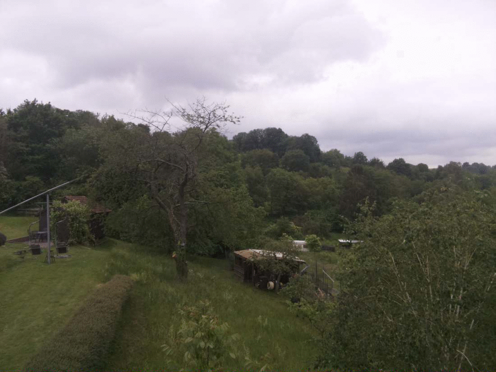
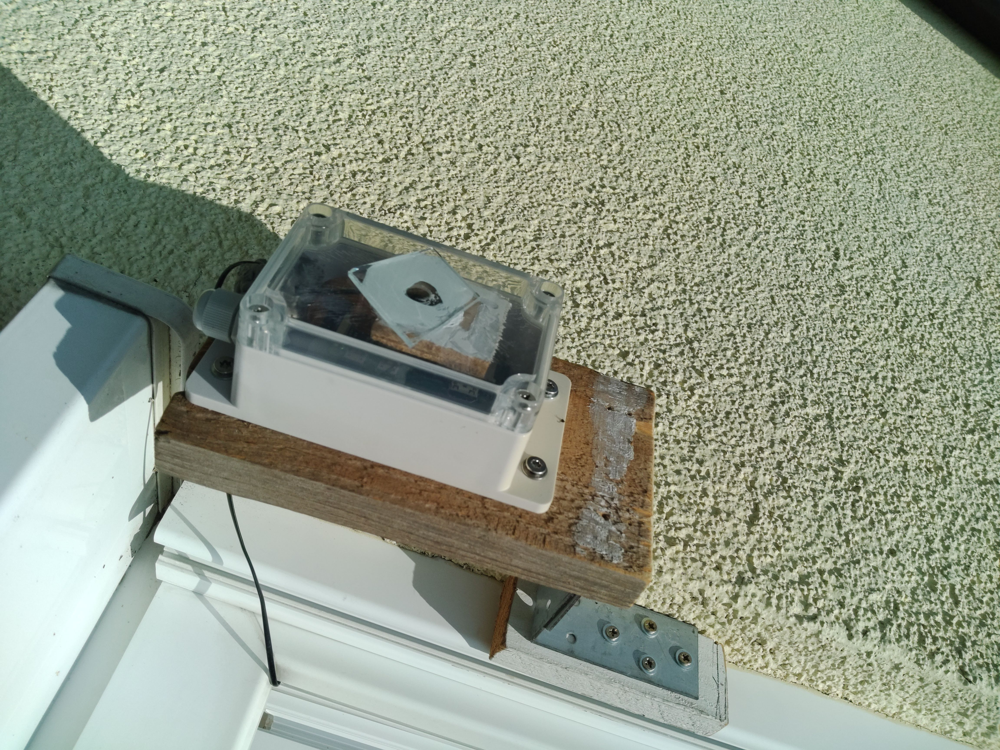

## Introduction
This is a fun project I started to create timelapse clips of my garden. The idea in the long run is to create a facinating clip covering all four seasons across the entire year.

## Implementation
I bought a [Raspberry Pi Zero W](https://www.reichelt.com/at/de/raspberry-pi-zero-w-v-1-1-1-ghz-512-mb-ram-wlan-bt-rasp-pi-zero-w-p256438.html?r=1), the [Raspberry Pi camera module](https://www.reichelt.com/at/de/raspberry-pi-kamera-8mp-v2-1-imx219pq-rasp-cam-2-p170853.html?r=1) and a [waterproof case](https://www.reichelt.com/at/de/wasserdichtes-gehaeuse-ip66-sonoff-im1710170-p271506.html?&trstct=pos_0&nbc=1), added some spare parts and attatched the constrution at a nice spot outside the window.

On the software side the Raspberry Pi Zero W is taking an image at certain intervals (e.g. every 5 minutes) during the day and uploads them to my local network as it's the most convenient for me.

To determine sunrise and sunset at my place I utilized [this](https://www.anginf.de/?p=138) awesome bash script.

